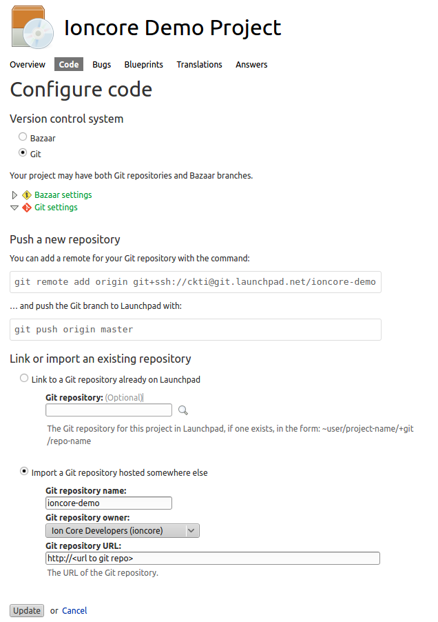
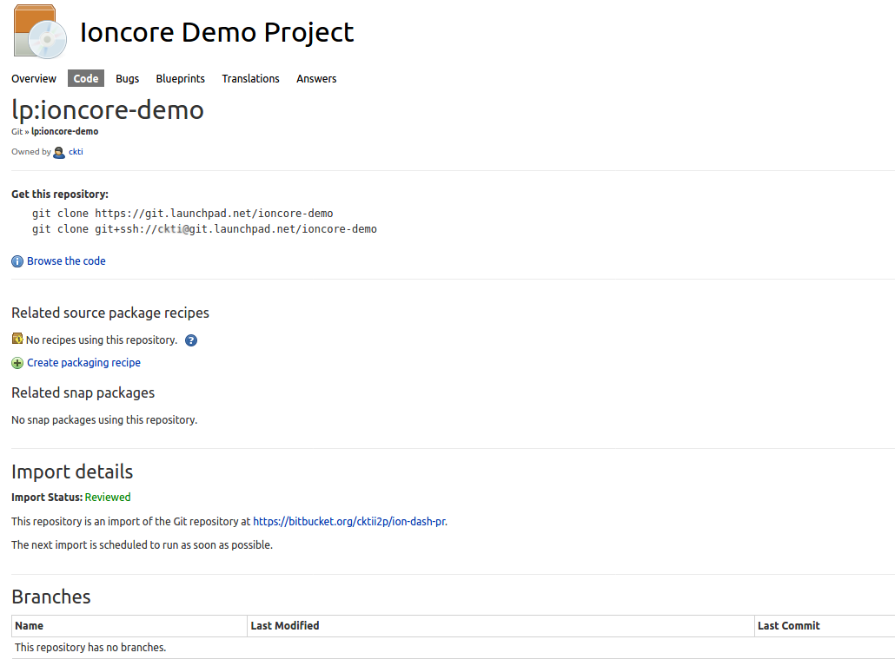
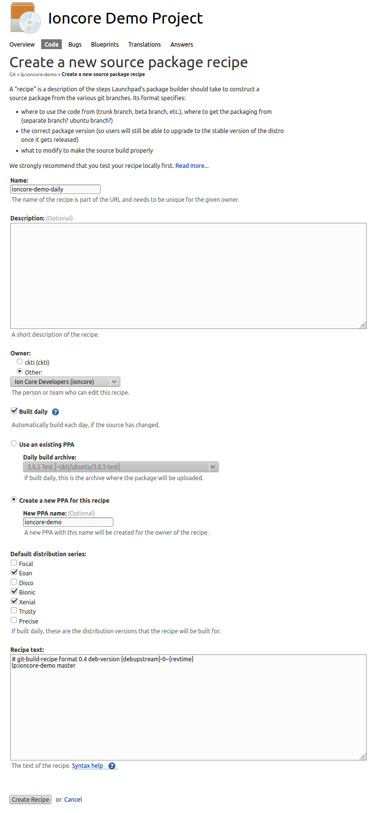
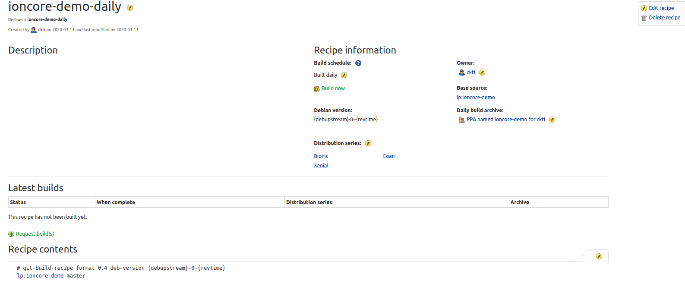
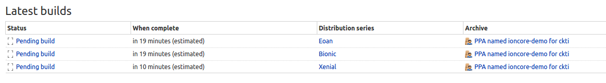

Building Launchpad Recipes
==========================
- ## Log in to launchpad using your ubuntu one login  
- ## Select "Register a Project" at [Launchpad's Home Page](http://launchpad.net)  

 

- ## In the next screen enter the required information into the form and click continue  

 
  
- ## Make sure this is not a duplicate project  

 

- ## Enter the Registration Detailsand clock on Complete Registration

 

- ## On the right hand side of your screen you will see a box like this, select code

 

- ## On this screen you can enter the git repository url that you will build the recipe from  

 

- ## From this screen select "Create Packaging Recipe" Note-> it may take a while for the initial import, be patient

 

- ## The next screen will allow you to enter the details of your recipe. Create a new PPA for the results and choose what distributions you want to build for.  Xenial, Bionic and Eoan are all that are in support right now. The default build of the master branch is all you need in the recipe text

 

- ## On this next screen you can manually build the recipe by selecting "Build Now" or "Request Build".

- ## Note, if a build has already begun you will not be able to build for those distributions.

 

- ## you will be able to watch the status of your build as it progresses.

 

- ## Once the build has finished, add your new PPA to your system as usual and install the package(s)