Building Launchpad Snaps
==========================
- ## Log in to launchpad using your ubuntu one login  
- ## Select "Register a Project" at [Launchpad's Home Page](http://launchpad.net)  

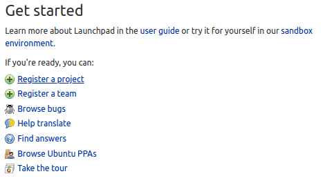 

- ## In the next screen enter the required information into the form and click continue  

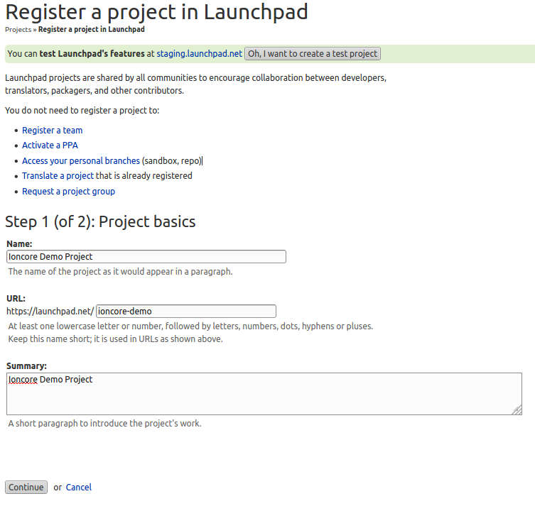 
  
- ## Make sure this is not a duplicate project  

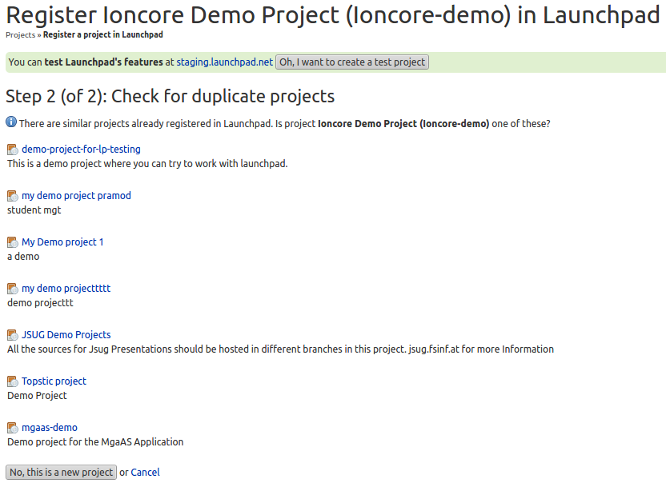 

- ## Enter the Registration Details and click on Complete Registration

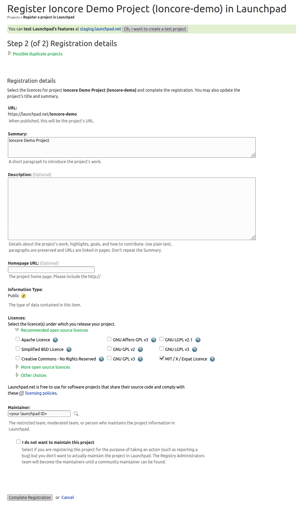 

- ## On the right hand side of your screen you will see a box like this, select code

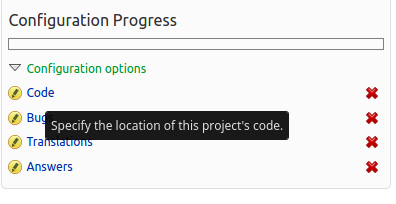 

- ## On this screen you can enter the git repository url that you will build the snap package from  

 

- ## Click on one for the branches you have imported from git

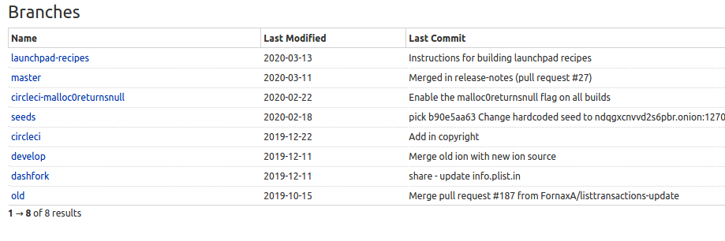 

- ## Click on Create snap package

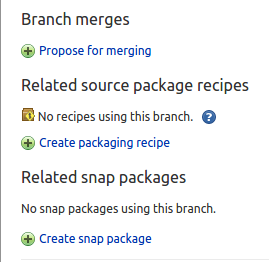 

- ## Create a name for your snap package
- ## Select Ubuntu Bionic Series

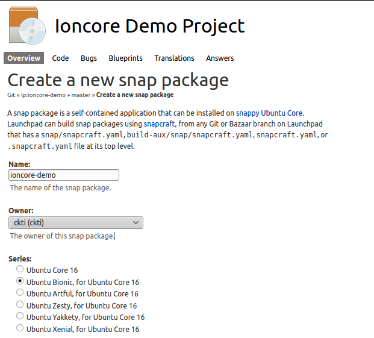 

- ## Select the processors to build for

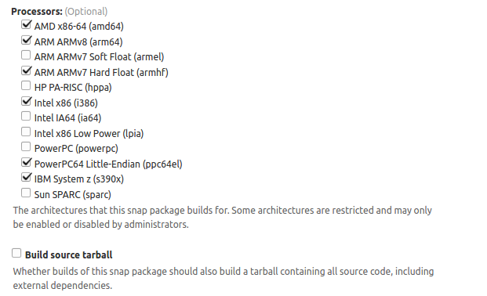 

- ## Select Automatically upload to store
- ## Enter Store name
- ## Select channel to build for
- ## Click Create snap package

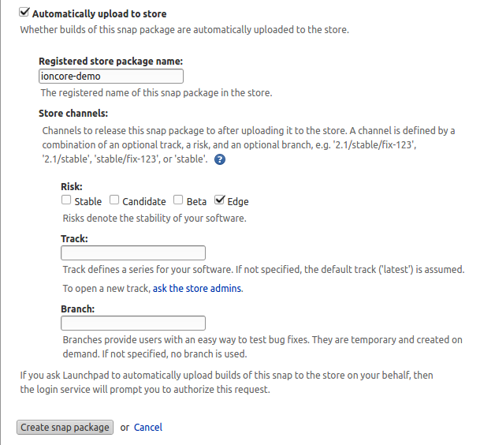 

- ## You will be redirected to enter your Ubuntu One details

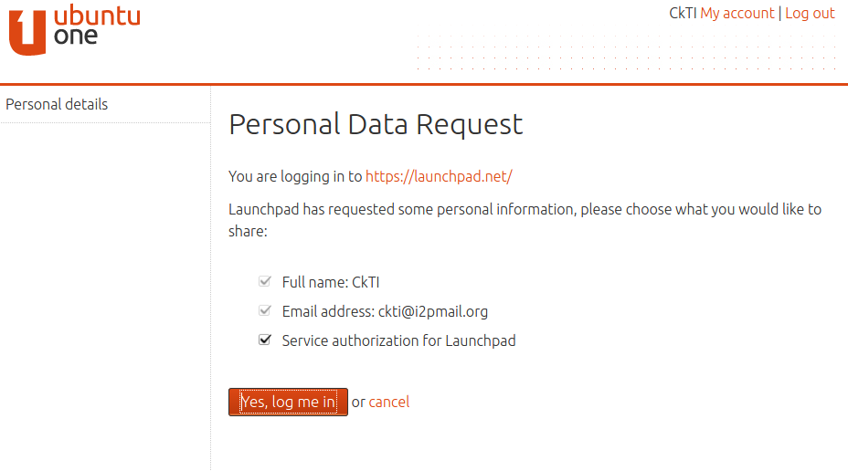 

- ## You will see a popup telling you that Uploads are now authorized

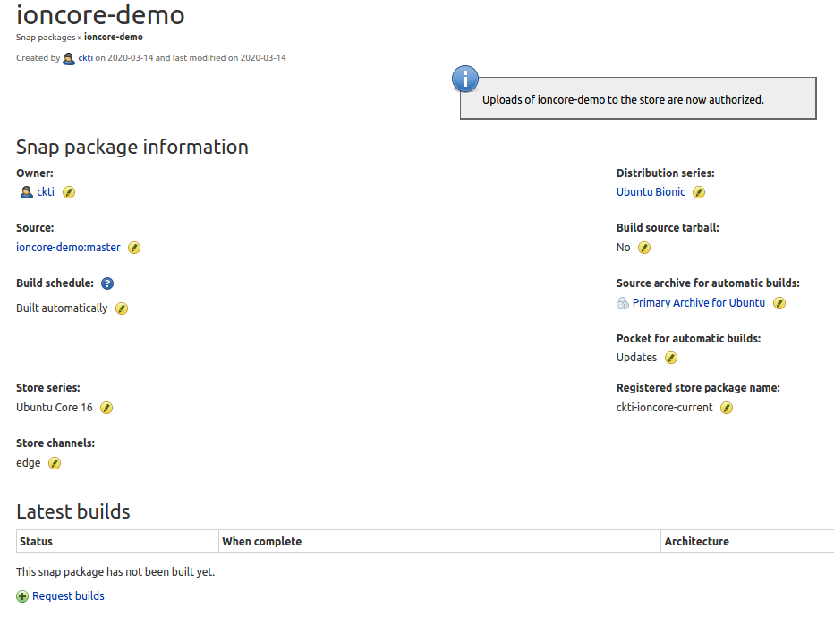 

- ## You can now request snap builds
